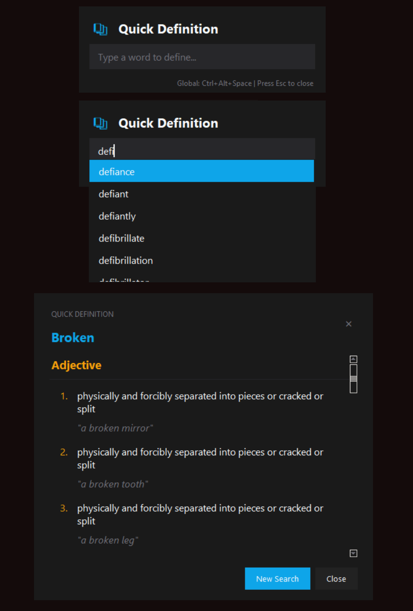

# Quick Definition

A lightweight, keyboard-driven dictionary application that provides instant word definitions with a clean, modern UI.



## Features

- 📚 Instant word definitions with a global keyboard shortcut
- 🔍 Local WordNet database for offline use
- 🌐 Fallback to online API when needed
- 💡 Word suggestions as you type
- 🎨 Clean, modern UI with dark mode
- ⌨️ Fully keyboard navigable
- 🖥️ Cross-platform (Windows, macOS, Linux)

## Installation

### Prerequisites

- Python 3.6 or later
- pip

### Setup

1. Clone this repository:
   ```
   git clone https://github.com/DiyarD/quickdefinition.git
   cd quickdefinition
   ```

2. Install the required dependencies:
   ```
   pip install -r requirements.txt
   ```

3. Setup the WordNet database (optional but highly recommended for faster offline use):
   ```
   python build_database.py
   ```
   This will download WordNet data and create a local database.

## Usage

1. Run the application:
   ```
   python app.py
   ```

2. Press `Ctrl+Alt+D` (Windows/Linux) or `Cmd+Alt+D` (macOS) to bring up the input window.

3. Type a word and press Enter to get its definition.

### Keyboard Shortcuts

- `Ctrl+Alt+D` / `Cmd+Alt+D`: Show input window
- `Esc`: Close current window
- `Enter` (in input field): Search for definition
- Arrow keys: Navigate suggestion list

## Troubleshooting

### Hotkey Not Working

On some systems, the global hotkey might not work due to permission issues:

- **Linux**: Make sure you have the required X11 libraries installed:
  ```
  sudo apt-get install python3-xlib
  ```
  Or try running the app with sudo (not recommended for regular use).

- **macOS**: You might need to grant accessibility permissions to Terminal or the app in System Preferences > Security & Privacy > Privacy > Accessibility.

### Missing Font

If the UI looks off, it might be due to missing fonts:

- **Windows**: Install Segoe UI font
- **macOS**: San Francisco font should be available by default
- **Linux**: Install Noto Sans font (`sudo apt-get install fonts-noto` on Debian/Ubuntu)

## Credits

- Dictionary API: [Free Dictionary API](https://dictionaryapi.dev/)
- WordNet: [Princeton WordNet](https://wordnet.princeton.edu/)
- NLTK: [Natural Language Toolkit](https://www.nltk.org/)

## License

This project is licensed under the MIT License - see the [LICENSE](LICENSE) file for details.
